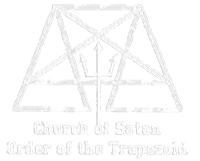
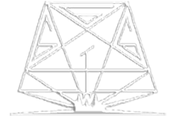

# Evolution of the Order of the Trapezoid Insignia

*by Sir Michael A. Aquino, Ph.D., Grand Master Emeritus*

For a recent year XX/1985 issue of the _**Cloven Hoof**_, Anton Szandor LaVey wrote a one-page commentary concerning the Church of Satan origins of the Order of the Trapezoid and its insignia. It is an interesting story, though inconsistent in some respects with Anton's original December V / 1970 *Cloven Hoof* definition of the Order [as cited in the Order's Charter].

According to this new commentary, the original O.Tr. was identical with the pre-1966 Magic Circle, organized in 1957, that met at the California Street house. [If so, it was not previously mentioned, as during the Age of Satan the pre-1966 group was always referred to formally and informally as the "Magic Circle"]. The idea for the O.Tr. insignia, continues Anton, came from the open-bottomed pentagram of a Costa Rican Satanist group, _**Los Hermanos Diablo**_, to which Anton added a surrounding trapezoid, the three 6s of the "Book of Revelation" and an upthrust trident, thus:

This emblem, says Anton, was worn for ritual use by all members of the Magic Circle. This I cannot verify, not having attended activities of the Church until IV / 1969&mdash;nor were any trapezoidal pendants in evidence at that time. Anton's illustration for the cover of the February 1970 _**Hoof**_, however, shows a procession of the Council of Nine departing a trapezoidal tower topped by a crescent moon (presumably one of the "seven towers of Satan" cited by William Seabrook in his _**Adventures in Arabia**_), and the hooded Nine are shown wearing trapezoidal pendants like that shown above. This seems to suggest that the pendant was originally the emblem of the Nine, rather than of the entire Magic Circle.

In non-ritual situations, continues Anton, the trapezoidal pendant hidden by an identically-shaped trapezoidal panel embellished with a picture of the bat-daemon:

{: .center-image}

This, I might add, is a beautiful example of the LaVey artistic style, which combines graceful, flowing lines with claw-like twists and unexpected convolutions. As a pre-teen child in the 1950s spending occasional weekends in Forest Knells, a tiny forest community in the Marin County backwoods north of San Francisco, I used to admire the painted sign of a bat on one of the houses tucked away under the trees of Tamal Road. Twenty years later I mentioned this to Anton, and leamed to my surprise that he had painted it for the house's owner, someone he called "Crazy Charlie." [I suppose it's just as well I never tried to trick-or-treat there back in the 50s!]

In any case, neither the trapezoidal pendant nor its bat-cover were in evidence around the Central Grotto by V / 1970, when I was ordained to the Priesthood and appointed to the Council of Nine. Instead, at meetings of the Council which I attended that year, Councillors wore a fire-enameled copper medallion with the following seal:

The background of this medallion was black, with the trapezoid, trident, and 666 in white. At the base of the medallion were red & yellow flames, from which the trident emerged. This medallion remained the only one used henceforth by the C/S Council of Nine through X / 1975. For non-Council functions, Councillors normally wore the appropriate Baphomet of degree. Hence, apart from the Council meetings attended in San Francisco, the only occasions on which I donned this particular medallion had to do with the chartering of Grottos or the ordaining of Priests and Priestesses. (Recall that, in the Church of Satan, Masters IV° did not have the authority to ordain; only the High Priest did. Hence ceremonies of ordination required Council insignia.)

The next modification to the O.Tr. insignia took place around VII / 1972, and appeared only on stationary. Here Anton had dropped the 666, restored the over/under arms on the pentagram, and contrasted a white-outlined trapezoid & pentagram with a solid black trident. On letterhead the trident emerged from the "o" of "Church of Satan": 

{: .center-image}

For his _**Cloven Hoof**_ essays as High Priest, Anton would occasionally surmount this insignia with a sketch of his own head, glowering appropriately [and without the text underneath].

The final variation on the O.Tr. insignia in the Church of Satan took place in 1974, when Anton was serving as technical advisor to the motion picture _**The Devil's Rain**_. In addition to composing ritual texts, coaching extras in Enochian chanting, etc., he took a hand in the designing of sets. The altar cloth used by Ernest Borgnine incorporated a plain pentagram containing the phrase "Rege Satanas," but there were several more interesting and elaborate decorations in the background of the church for those attuned to such things. On the front of the balcony, for example, was: 

{: .center-image}

... in white against black. This is an excellent illustration by the way, of the care which Anton devoted to his magical artwork. In addition to the pentagram and central trapezoid motif, note that each side-panel has a total of nine horizontal lines, and that the terminus of the lines suggests the _**Laguz**_-rune, Key to the life-force/reincarnation&mdash;a not-inappropriate symbol for the theme of _**The Devil's Rain**_. While I am not able to measure the actual painting above [the above reproduction was sketched from a videotape print of _**The Devil's Rain**_] my guess is that the thickness of the lines, distances between them, and the overall proportions of the entire painting were mathematically precise. Probably none of the actors passing beneath the painting knew consciously about the symbols or proportions it incorporated, but Anton knew. And the effects upon both him and the actors & film crew may be deduced from the Law of the Trapezoid.

Within the Temple of Set, the Order of the Trapezoid was defined initially in X / 1975 as the Priesthood; i.e., degrees III°+. While this was done as a matter of record, to restore the Order to the meaning it had had most prominently during the I-X period, nothing was initially done about the insignia&mdash;for the obvious reason that the Judeo-Christian symbolism of the "666" and Satanic trident seemed rather at odds with the Temple's trans-Judeo/Christian orientation. Also to be considered were the instructions of Set in the _**Book of Coming Forth by Night**_ that the pentagram was to be "pure," which you don't do by cutting the bottom point off.

At a Set-I (XIV / 1979) Council of Nine meeting I proposed replacing the trident with a left-facing _**tcham**_-sceptre, and at the same time the Temple adopted the policy that the O.Tr. would henceforth be used as the *ex officio* dignity for all present and past members of the Council of Nine. In XVI / 1981 High Priest Ronald K. Barrett, who still felt that the pentagram should not be touched or abbreviated by the trapezoid in any way, instituted this rather stark version of the emblem for the O.Tr. [The mathematical proportions of the lines and figures were no longer keyed to the _**phi**_-ratio, which adds to the rather unattractive appearance of the emblem.]

It made a solitary appearance in the _**Scroll of Set**_ (Issue #VI-6) after which it was (mercifully) not used again.

The emblem that is used today for the Order of the Trapezoid was conceived in the Wewelsburg Castle, Westphalia, Germany during the Wewelsburg Working on October 19, XVII / 1982 in the Hall of the Dead (_**Walhalla**_), was sketched out on a desk in the Wewelsburg caretaker's office (when I returned the Walhalla keys to him following the Working), and was drafted in precise mathematical proportions on a table in Eva Braun's tea-room in the Eagle's Nest at Obersalzberg. I could have done the drafting before then, but wanted the environment to be magically appropriate. There were a few tourists milling around the main room of the Eagle's Nest, but as it turned out I had the wood-paneled tea-room to myself.]

{: .center-image}

The insignia is described in detail in the statement of the Order in the _**Ruby Tablet**_, but a few incidental comments might be added: In addition to the restoration of the *phi*-proportions, it was important to avoid all curved lines altogether; hence the head & tail of the *tcham*-sceptre, the 666, and the flames (restored from the C/S medallion) were all "angled." It will be noticed that the pentagram's outline is complete, though it goes through three different "media" at the bottom: the flames, the *W*, and finally the pentagram itself. All of the trapezoids are similarly unbroken, though several of them "change media" as well. Furthermore the angles of the flames together with those of the diagram above create more trapezoids and *phi*-ratios.

---

| :----------------------------------------- | :--------------: | --------------------: |
| &laquo; *Back to [Thought](/thought.html)* | &#9750; *Up to [Home](/)* | *Return to [Top of Page](#top)* &raquo; |
| :----------------------------------------- | :--------------: | --------------------: |
| | | |
{:.widetable}
